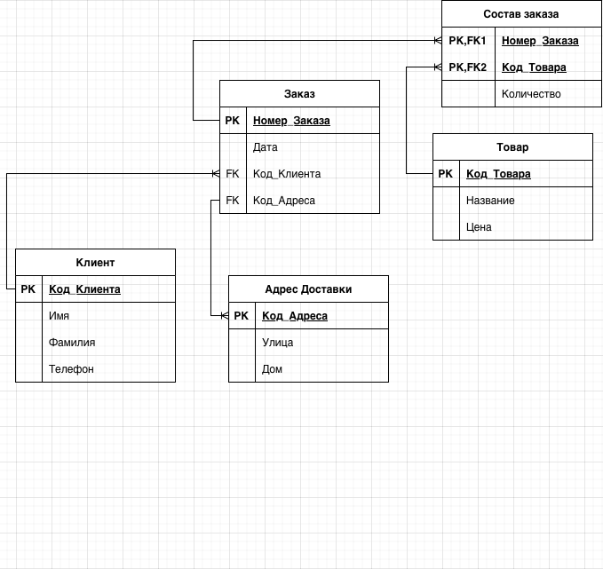

## Исходный вид

#### Определите, в какой нормальной форме находится данная таблица. Поясните почему вы сделали такой вывод.
Таблица находится в ненормализованном виде. Отсутствуют признаки первой, второй и третьей нормальной формы

| Номер_Заказа | Дата_Заказа | Имя_Клиента      | Телефон_Клиента | Адрес_Доставки       | Код_Товара      | Название_Товара                  | Цена_Товара     | Количество    | Стоимость_Заказа |
|--------------|-------------|------------------|-----------------|----------------------|-----------------|----------------------------------|-----------------|---------------|------------------|
| 1            | 01-10-2023  | Иван Иванов      | 123-4567        | Ул. Ленина, д. 10    | 101, 102        | Молоко, Хлеб                     | 50, 30          | 2, 1          |  130             |
| 2            | 01-10-2023  | Петр Петров      | 987-6543        | Ул. Мира, д. 5       | 103             | Сахар                            | 40              | 1             | 40               |
| 3            | 02-10-2023  | Ольга Орлова     | 555-1234        | Ул. Крылова, д. 7    | 104, 105, 106   | Яблоки, Бананы, Апельсины        | 70, 80, 90      | 1, 2, 1       | 320              |
| 4            | 02-10-2023  | Иван Иванов      | 123-4567        | Ул. Ленина, д. 10    | 107             | Кофе                             | 150             | 1             | 150              |
| 5            | 03-10-2023  | Анна Антонова    | 222-3333        | Ул. Солнечная, д. 3  | 108, 109        | Чай, Сок                         | 60, 40          | 2, 3          | 260              |
| 6            | 03-10-2023  | Сергей Сергеев   | 444-5555        | Ул. Озерная, д. 8    | 101             | Молоко                           | 50              | 1             | 50               |
| 7            | 04-10-2023  | Петр Петров      | 987-6543        | Ул. Мира, д. 5       | 110, 111        | Хлеб, Масло                      | 30, 120         | 1, 1          | 150              |
| 8            | 04-10-2023  | Ольга Орлова     | 555-1234        | Ул. Крылова, д. 7    | 112             | Сыр                              | 200             | 1             | 200              |
| 9            | 05-10-2023  | Анна Антонова    | 222-3333        | Ул. Солнечная, д. 3  | 113, 114        | Шоколад, Печенье                 | 80, 60          | 2, 3          | 360              |
| 10           | 05-10-2023  | Сергей Сергеев   | 444-5555        | Ул. Озерная, д. 8    | 115             | Йогурт                           | 70              | 2             | 140              |

## Первая нормальная форма

#### Приведите таблицу к первой нормальной форме (1НФ). Опишите шаги, которые вы предприняли для устранения нарушений 1НФ.
Таблица избавлена от дублирования. Каждая запись имеет только одно значение

| Номер_Заказа | Дата_Заказа   | Имя_Клиента | Фамилия_Клиента   | Телефон_Клиента | Улица_Доставки  | Дом_Доставки | Код_Товара | Название_Товара | Цена_Товара | Количество | Стоимость_Заказа |
|--------------|---------------|-------------|-------------------|-----------------|-----------------|--------------|------------|-----------------|-------------|------------|------------------|
| 1            | 01-10-2023    | Иван        | Иванов            | 123-4567        | Ул. Ленина      | д. 10        | 101        | Молоко          | 50          | 2          | 130              |
| 1            | 01-10-2023    | Иван        | Иванов            | 123-4567        | Ул. Ленина      | д. 10        | 102        | Хлеб            | 30          | 1          | 130              |
| 2            | 01-10-2023    | Петр        | Петров            | 987-6543        | Ул. Мира        | д. 5         | 103        | Сахар           | 40          | 1          | 40               |
| 3            | 02-10-2023    | Ольга       | Орлова            | 555-1234        | Ул. Крылова     | д. 7         | 104        | Яблоки          | 70          | 1          | 320              |
| 3            | 02-10-2023    | Ольга       | Орлова            | 555-1234        | Ул. Крылова     | д. 7         | 105        | Бананы          | 80          | 2          | 320              |
| 3            | 02-10-2023    | Ольга       | Орлова            | 555-1234        | Ул. Крылова     | д. 7         | 106        | Апельсины       | 90          | 1          | 320              |
| 4            | 02-10-2023    | Иван        | Иванов            | 123-4567        | Ул. Ленина      | д. 10        | 107        | Кофе            | 150         | 1          | 150              |
| 5            | 03-10-2023    | Анна        | Антонова          | 222-3333        | Ул. Солнечная   | д. 3         | 108        | Чай             | 60          | 2          | 260              |
| 5            | 03-10-2023    | Анна        | Антонова          | 222-3333        | Ул. Солнечная   | д. 3         | 109        | Сок             | 40          | 3          | 260              |
| 6            | 03-10-2023    | Сергей      | Сергеев           | 444-5555        | Ул. Озерная     | д. 8         | 101        | Молоко          | 50          | 1          | 50               |
| 7            | 04-10-2023    | Петр        | Петров            | 987-6543        | Ул. Мира        | д. 5         | 110        | Хлеб            | 30          | 1          | 150              |
| 7            | 04-10-2023    | Петр        | Петров            | 987-6543        | Ул. Мира        | д. 5         | 111        | Масло           | 120         | 1          | 150              |
| 8            | 04-10-2023    | Ольга       | Орлова            | 555-1234        | Ул. Крылова     | д. 7         | 112        | Сыр             | 200         | 1          | 200              |
| 9            | 05-10-2023    | Анна        | Антонова          | 222-3333        | Ул. Солнечная   | д. 3         | 113        | Шоколад         | 80          | 2          | 360              |
| 9            | 05-10-2023    | Анна        | Антонова          | 222-3333        | Ул. Солнечная   | д. 3         | 114        | Печенье         | 60          | 3          | 360              |
| 10           | 05-10-2023    | Сергей      | Сергеев           | 444-5555        | Ул. Озерная     | д. 8         | 115        | Йогурт          | 70          | 2          | 140              |

## Вторая нормальная форма

#### Приведите таблицу ко второй нормальной форме (2НФ). Опишите шаги, которые вы предприняли для устранения нарушений 2НФ.
Исходная таблица разбита на 3, где каждый неключевой атрибут зависит от всего ключа, а не от его части

### Таблица - Состав Заказа
| Номер_Заказа (PK, FK) | Код_Товара (PK, FK) | Количество |
|-----------------------|---------------------|------------|
| 1                     | 101                 | 2          |
| 1                     | 102                 | 1          |
| 2                     | 103                 | 1          |
| 3                     | 104                 | 1          |
| 3                     | 105                 | 2          |
| 3                     | 106                 | 1          |
| 4                     | 107                 | 1          |
| 5                     | 108                 | 2          |
| 5                     | 109                 | 3          |
| 6                     | 101                 | 1          |
| 7                     | 102                 | 1          |
| 7                     | 110                 | 1          |
| 8                     | 111                 | 1          |
| 9                     | 112                 | 2          |
| 9                     | 113                 | 3          |
| 10                    | 114                 | 2          |

### Таблица - Заказ
| Номер_Заказа (PK) | Дата_Заказа | Имя_Клиента | Фамилия_Клиента | Телефон_Клиента | Улица_Доставки | Дом_Доставки |
|-------------------|-------------|-------------|-----------------|-----------------|----------------|--------------|
| 1                 | 01-10-2023  | Иван        | Иванов          | 123-4567        | Ул. Ленина     | д. 10        |
| 2                 | 01-10-2023  | Петр        | Петров          | 987-6543        | Ул. Мира       | д. 5         |
| 3                 | 02-10-2023  | Ольга       | Орлова          | 555-1234        | Ул. Крылова    | д. 7         |
| 4                 | 02-10-2023  | Иван        | Иванов          | 123-4567        | Ул. Ленина     | д. 10        |
| 5                 | 03-10-2023  | Анна        | Антонова        | 222-3333        | Ул. Солнечная  | д. 3         |
| 6                 | 03-10-2023  | Сергей      | Сергеев         | 444-5555        | Ул. Озерная    | д. 8         |
| 7                 | 04-10-2023  | Петр        | Петров          | 987-6543        | Ул. Мира       | д. 5         |
| 8                 | 04-10-2023  | Ольга       | Орлова          | 555-1234        | Ул. Крылова    | д. 7         |
| 9                 | 05-10-2023  | Анна        | Антонова        | 222-3333        | Ул. Солнечная  | д. 3         |
| 10                | 05-10-2023  | Сергей      | Сергеев         | 444-5555        | Ул. Озерная    | д. 8         |

### Таблица - Товар
| Код_Товара (PK) | Название_Товара | Цена_Товара |
|-----------------|-----------------|-------------|
| 101             | Молоко          | 50          |
| 102             | Хлеб            | 30          |
| 103             | Сахар           | 40          |
| 104             | Яблоки          | 70          |
| 105             | Бананы          | 80          |
| 106             | Апельсины       | 90          |
| 107             | Кофе            | 150         |
| 108             | Чай             | 60          |
| 109             | Сок             | 40          |
| 110             | Масло           | 120         |
| 111             | Сыр             | 200         |
| 112             | Шоколад         | 80          |
| 113             | Печенье         | 60          |
| 114             | Йогурт          | 70          |

## Третья нормальная форма

#### Приведите таблицу к третьей нормальной форме (3НФ). Опишите шаги, которые вы предприняли для устранения нарушений 3НФ.
- Таблица - Состав заказа - Уже приведена к 3НФ 
- Таблица - Товар - Уже приведена к 3НФ 
- Таблица - Заказ - Была разбита на три таблицы 
  - Таблицы Заказ 
  - Таблица Клиент 
  - Таблица Адрес Доставки

### Таблица - Состав Заказа
| Номер_Заказа (PK, FK) | Код_Товара (PK, FK) | Количество |
|-----------------------|---------------------|------------|
| 1                     | 101                 | 2          |
| 1                     | 102                 | 1          |
| 2                     | 103                 | 1          |
| 3                     | 104                 | 1          |
| 3                     | 105                 | 2          |
| 3                     | 106                 | 1          |
| 4                     | 107                 | 1          |
| 5                     | 108                 | 2          |
| 5                     | 109                 | 3          |
| 6                     | 101                 | 1          |
| 7                     | 102                 | 1          |
| 7                     | 110                 | 1          |
| 8                     | 111                 | 1          |
| 9                     | 112                 | 2          |
| 9                     | 113                 | 3          |
| 10                    | 114                 | 2          |

### Таблица - Заказ
| Номер_Заказа (PK) | Дата       | Код_Клиента (FK) | Код_Адреса (FK) |
|-------------------|------------|------------------|-----------------|
| 1                 | 01-10-2023 | 1                | 1               |
| 2                 | 01-10-2023 | 2                | 2               |
| 3                 | 02-10-2023 | 3                | 3               |
| 4                 | 02-10-2023 | 1                | 1               |
| 5                 | 03-10-2023 | 4                | 4               |
| 6                 | 03-10-2023 | 5                | 5               |
| 7                 | 04-10-2023 | 2                | 2               |
| 8                 | 04-10-2023 | 3                | 3               |
| 9                 | 05-10-2023 | 4                | 4               |
| 10                | 05-10-2023 | 5                | 5               |

### Таблица - Клиент
| Код_Клиента (PK) | Имя    | Фамилия  | Телефон  |
|------------------|--------|----------|----------|
| 1                | Иван   | Иванов   | 123-4567 |
| 2                | Петр   | Петров   | 987-6543 |
| 3                | Ольга  | Орлова   | 555-1234 |
| 4                | Анна   | Антонова | 222-3333 |
| 5                | Сергей | Сергеев  | 444-5555 |

### Таблица - Адрес Доставки
| Код_Адреса (PK) | Улица         | Дом   |
|-----------------|---------------|-------|
| 1               | Ул. Ленина    | д. 10 |
| 2               | Ул. Мира      | д. 5  |
| 3               | Ул. Крылова   | д. 7  |
| 4               | Ул. Солнечная | д. 3  |
| 5               | Ул. Озерная   | д. 8  |

### Таблица - Товар
| Код_Товара (PK) | Название  | Цена  |
|-----------------|-----------|-------|
| 101             | Молоко    | 50    |
| 102             | Хлеб      | 30    |
| 103             | Сахар     | 40    |
| 104             | Яблоки    | 70    |
| 105             | Бананы    | 80    |
| 106             | Апельсины | 90    |
| 107             | Кофе      | 150   |
| 108             | Чай       | 60    |
| 109             | Сок       | 40    |
| 110             | Масло     | 120   |
| 111             | Сыр       | 200   |
| 112             | Шоколад   | 80    |
| 113             | Печенье   | 60    |
| 114             | Йогурт    | 70    |

#### Вопрос 1: Объясните, в каких случаях может потребоваться денормализация базы данных?
Ответ: Денормализация может потребоваться для снижения количества связей с целью более быстрого получения информации за счет ее содержания в других таблицах, доступ к которым можно получить меньшим количеством связей 

#### Вопрос 2: Предложите один вариант денормализации для вашей нормализованной базы данных, который мог бы повысить производительность запросов или упростить структуру данных. Объясните свой выбор.
Ответ: Можно добавить дополнительное поле Стоимость заказа в таблицу Заказ, чтобы не приходилось просчитывать это значение, путем запроса в несколько таблиц (Товар.Цена_Товара, Состав Заказа.Количество)

#### Вопрос 3: Нарисуйте ER-диаграмму для полученной нормализованной базы данных, обозначив связи между таблицами.
Ответ: 

#### Вопрос 4: Если в вашей нормализованной базе данных присутствуют связи многие-ко-многим, предложите способы их реализации в реляционной базе данных. Опишите, какие дополнительные таблицы или поля для этого нужны.
Ответ: В данной нормализованной базе данных отсутствуют таблицы, которые имеют связи многие-ко-многи. Однако при их существовании, требовалось бы добавить промежуточную таблицу, которая будет связывать записи из двух таблиц

